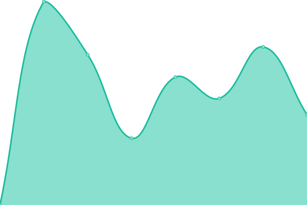
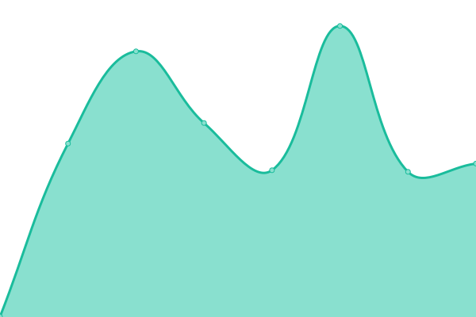

# [📈 Live Status](https://Babilou Family Netherlands.github.io/bfnl-status): <!--live status--> **🟧 Partial outage**

This repository contains the open-source uptime monitor and status page for [Babilou Family Netherlands](https://Babilou Family Netherlands.github.io/bfnl-status), powered by [Upptime](https://github.com/upptime/upptime).

With [Upptime](https://upptime.js.org), you can get your own unlimited and free uptime monitor and status page, powered entirely by a GitHub repository. We use [Issues](https://github.com/Babilou Family Netherlands/bfnl-status/issues) as incident reports, [Actions](https://github.com/Babilou Family Netherlands/bfnl-status/actions) as uptime monitors, and [Pages](https://Babilou Family Netherlands.github.io/bfnl-status) for the status page.

<!--start: status pages-->
<!-- This summary is generated by Upptime (https://github.com/upptime/upptime) -->
<!-- Do not edit this manually, your changes will be overwritten -->
<!-- prettier-ignore -->
| URL | Status | History | Response Time | Uptime |
| --- | ------ | ------- | ------------- | ------ |
|  [BLOS](https://www.blos.nl) | 🟩 Up | [blos.yml](https://github.com/perke/bfnl-status/commits/HEAD/history/blos.yml) | 

 272ms
     
 | 

<a href="https://Babilou Family Netherlands.github.io/bfnl-status/history/blos">100.00%</a>
    

|  [Bijdehandjes](https://www.bijdehandjes.info) | 🟩 Up | [bijdehandjes.yml](https://github.com/perke/bfnl-status/commits/HEAD/history/bijdehandjes.yml) | 

 362ms
     
 | 

<a href="https://Babilou Family Netherlands.github.io/bfnl-status/history/bijdehandjes">100.00%</a>
    

|  [Zonnekinderen](https://www.zonnekinderen.nl) | 🟩 Up | [zonnekinderen.yml](https://github.com/perke/bfnl-status/commits/HEAD/history/zonnekinderen.yml) | 

 1420ms
     
 | 

<a href="https://Babilou Family Netherlands.github.io/bfnl-status/history/zonnekinderen">99.85%</a>
    

|  [Zein Childcare](https://www.zeinchildcare.nl) | 🟩 Up | [zein-childcare.yml](https://github.com/perke/bfnl-status/commits/HEAD/history/zein-childcare.yml) | 

 2375ms
     
 | 

<a href="https://Babilou Family Netherlands.github.io/bfnl-status/history/zein-childcare">100.00%</a>
    

|  [IPv6 test](forwardemail.net) | 🟥 Down | [i-pv6-test.yml](https://github.com/perke/bfnl-status/commits/HEAD/history/i-pv6-test.yml) | 

 0ms
     
 | 

<a href="https://Babilou Family Netherlands.github.io/bfnl-status/history/i-pv6-test">100.00%</a>
    

<!--end: status pages-->

[**Visit our status website →**](https://Babilou Family Netherlands.github.io/bfnl-status)

## 📄 License

- Powered by: [Upptime](https://github.com/upptime/upptime)
- Code: [MIT](./LICENSE) © [Anand Chowdhary](https://anandchowdhary.com), supported by [Pabio](https://pabio.com)
- Data in the `./history` directory: [Open Database License](https://opendatacommons.org/licenses/odbl/1-0/)
