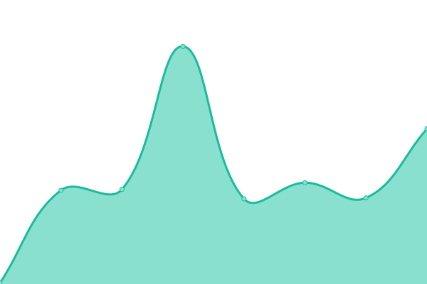

# [📈 Live Status](https://perke.github.io/bfnl-status): <!--live status--> **🟩 All systems operational**

This repository contains the open-source uptime monitor and status page for [Babilou Family Netherlands](https://perke.github.io/bfnl-status), powered by [Upptime](https://github.com/upptime/upptime).

With [Upptime](https://upptime.js.org), you can get your own unlimited and free uptime monitor and status page, powered entirely by a GitHub repository. We use [Issues](https://github.com/perke/bfnl-status/issues) as incident reports, [Actions](https://github.com/perke/bfnl-status/actions) as uptime monitors, and [Pages](https://perke.github.io/bfnl-status) for the status page.

<!--start: status pages-->
<!-- This summary is generated by Upptime (https://github.com/upptime/upptime) -->
<!-- Do not edit this manually, your changes will be overwritten -->
<!-- prettier-ignore -->
| URL | Status | History | Response Time | Uptime |
| --- | ------ | ------- | ------------- | ------ |
|  [Babilou Family Netherlands](https://babilou-family.nl) | 🟩 Up | [babilou-family-netherlands.yml](https://github.com/perke/bfnl-status/commits/HEAD/history/babilou-family-netherlands.yml) | 

 1859ms
     
 | 

<a href="https://status.babilou-family.nl/history/babilou-family-netherlands">98.49%</a>
    

|  [Basker](https://www.basker.nl) | 🟩 Up | [basker.yml](https://github.com/perke/bfnl-status/commits/HEAD/history/basker.yml) | 

 571ms
     
 | 

<a href="https://status.babilou-family.nl/history/basker">100.00%</a>
    

|  [Basker International](https://www.baskerinternational.nl) | 🟩 Up | [basker-international.yml](https://github.com/perke/bfnl-status/commits/HEAD/history/basker-international.yml) | 

 646ms
     
 | 

<a href="https://status.babilou-family.nl/history/basker-international">100.00%</a>
    

|  [Bijdehandjes](https://www.bijdehandjes.info) | 🟩 Up | [bijdehandjes.yml](https://github.com/perke/bfnl-status/commits/HEAD/history/bijdehandjes.yml) | 

 620ms
     
 | 

<a href="https://status.babilou-family.nl/history/bijdehandjes">100.00%</a>
    

|  [Speelschool](https://www.speelschool.nl) | 🟩 Up | [speelschool.yml](https://github.com/perke/bfnl-status/commits/HEAD/history/speelschool.yml) | 

 811ms
     
 | 

<a href="https://status.babilou-family.nl/history/speelschool">100.00%</a>
    

<!--end: status pages-->

[**Visit our status website →**](https://perke.github.io/bfnl-status)

## 📄 License

- Powered by: [Upptime](https://github.com/upptime/upptime)
- Code: [MIT](./LICENSE) © [Anand Chowdhary](https://anandchowdhary.com), supported by [Pabio](https://pabio.com)
- Data in the `./history` directory: [Open Database License](https://opendatacommons.org/licenses/odbl/1-0/)
